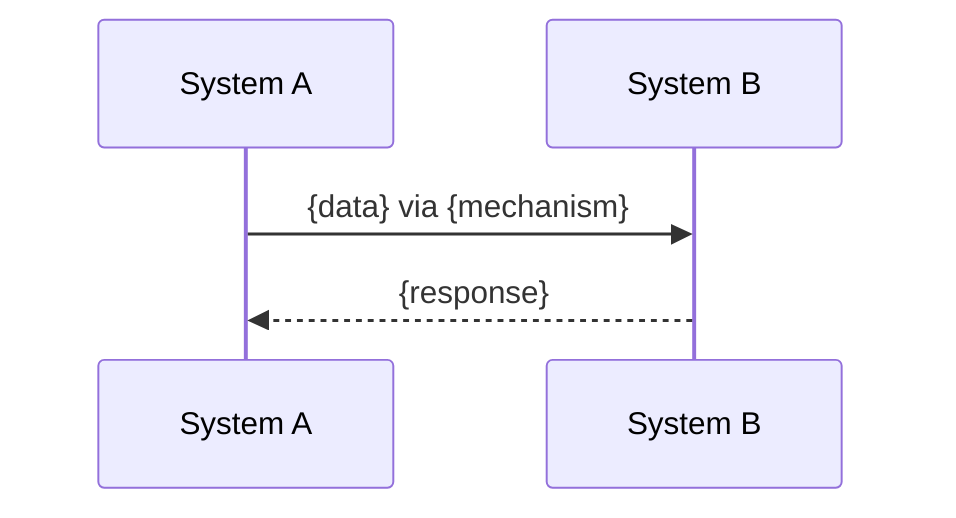

# {System A} ↔ {System B} Integration Design

## Systems Involved

```markdown
| System | Design | Owner |
|--------|--------|-------|
| {A} | [{a}.md](../path/to/{a}.md) | {domain} |
| {B} | [{b}.md](../path/to/{b}.md) | {domain} |
```

## Integration Requirements

```markdown
| ID | Requirement | Systems |
|----|-------------|---------|
| IR-X.Y.Z | {Integration requirement} | A, B |
```

## Data Contracts

Types shared between systems. Defined in ONE system,
consumed by the other.

```markdown
| Type | Defined In | Consumed By | Purpose |
|------|-----------|-------------|---------|
| {SharedType} | {System A} | {System B} | {purpose} |
```

```rust
/// Shared type definition (defined in one system):
pub struct SharedType {
    // fields...
}
```

## Data Flow

How data moves between systems at runtime.



## Timing and Ordering

Which game loop phase each system runs in, and the
ordering dependencies between them.

```markdown
| System | Phase | Ordering |
|--------|-------|----------|
| A | Update | Runs first |
| B | PostUpdate | After A |
```

## Failure Modes

What happens when the integration breaks.

```markdown
| Failure | Impact | Recovery |
|---------|--------|----------|
| A produces no data | B uses default/cached | Graceful degrade |
| B is not present | A skips output | Optional dependency |
```

## Platform Considerations

Per-platform differences in the integration.

## Test Plan

Integration tests that verify the boundary.

```markdown
| Test | Systems | Requirement |
|------|---------|-------------|
| {test_name} | A, B | IR-X.Y.Z |
```
